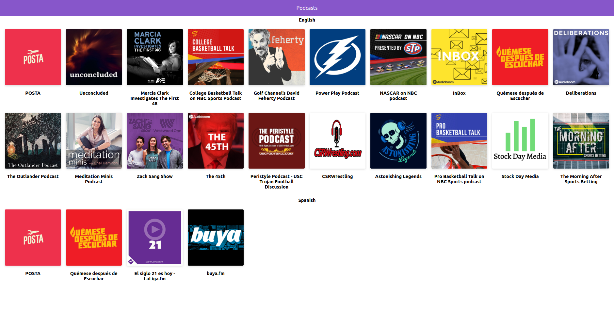

# App de Podcast de Platzi

App de Podcasts integrada con la API de AudioBoom para aprender NEXT.JS

## ¿Cómo funciona?

Requiere Node.JS 10

- `npm i` para instalar las dependencias
- `npm run dev` para el entorno de desarrollo.
- `npm run build && npm start` para el entorno de producción

## Licencia

MIT
